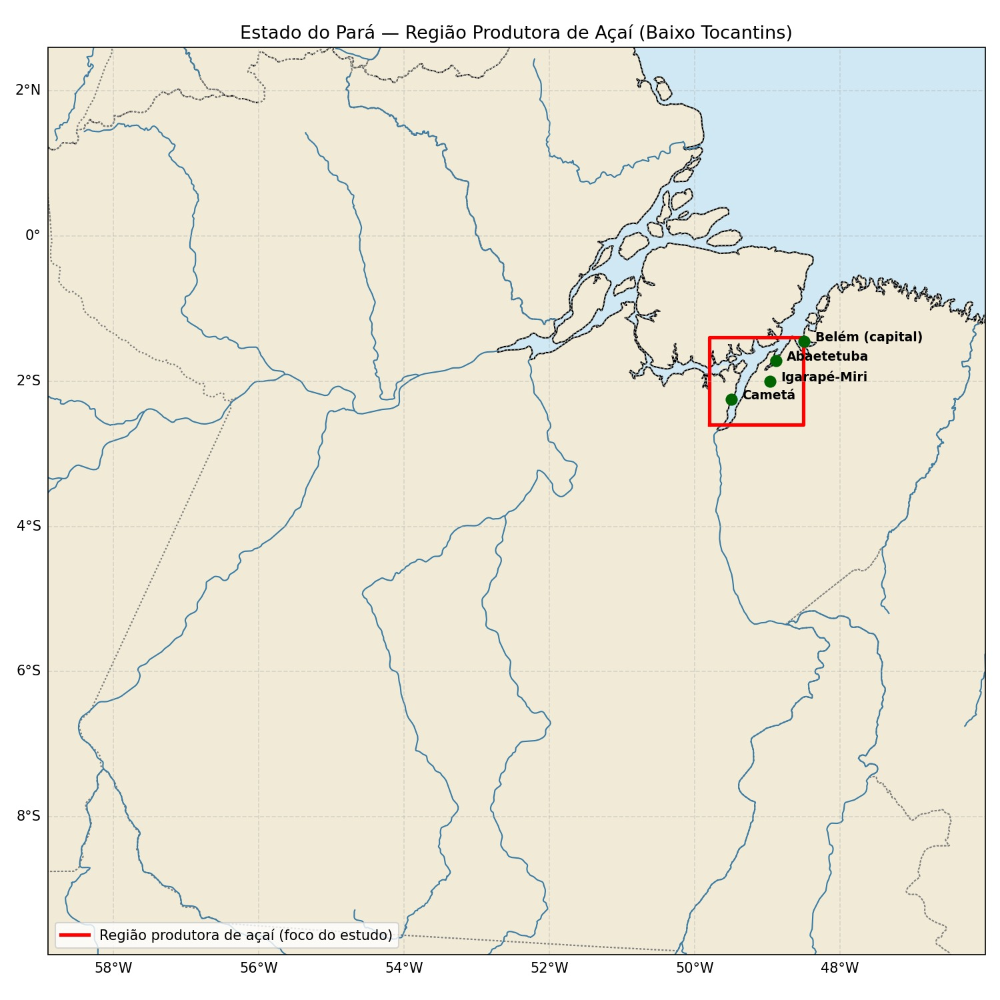
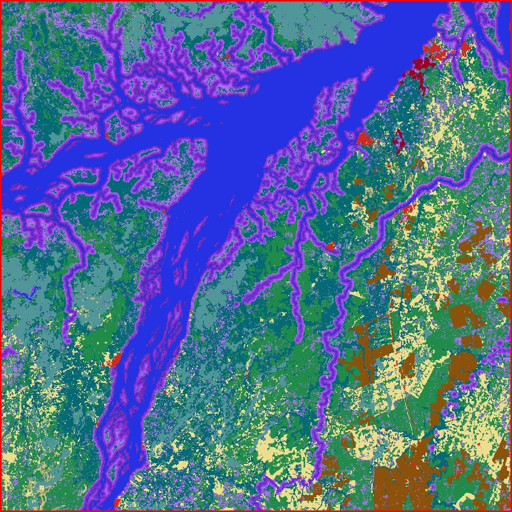

# Trabalho de GeoModelagem e Visão Computacional - Açaí e Barbeiro

Este repositório contém o desenvolvimento prático da análise integrada da produção de açaí no Estado do Pará, combinando geoprocessamento, dados meteorológicos, modelagem espacial e visão computacional.

## 🎓 Informações Acadêmicas

* **Instituição:** Universidade Estadual do Norte Fluminense Darcy Ribeiro (UENF)
* **Laboratório:** LAMET - Laboratório de Meteorologia
* **Programa:** Mestrado em Clima e Energia
* **Disciplina:** GeoModelagem do Potencial Energético e do Microclima Urbano
* **Professora:** Dra. Raquel Jahara Lobosco
* **Desenvolvido em Dupla por:** Ana Flávia Rodrigues Barcelos Cordeiro & Rayane Pereira de Souza

---

## 🗺️ Parte 1 – Mapeamento Climático

> 🚀 [Clique aqui para abrir o Notebook da Parte 1 (Mapas_acai.ipynb)](./Mapas_acai.ipynb)

Nesta etapa, criamos os mapas climáticos sazonais do Estado do Pará utilizando a biblioteca **Cartopy** em Python, destacando a principal região produtora de açaí (Igarapé-Miri, Cametá, Abaetetuba e entorno).

### 📍 Área de Estudo e Cobertura da Terra
Abaixo apresenta-se a delimitação da região produtora do Baixo Tocantins em foco e o respectivo mapeamento de uso e cobertura do solo:

  
  

Foram processados dados meteorológicos da base **Copernicus (ERA5/ERA5-Land)** referentes ao ano de 2024 (horário das 15h). Abaixo estão os mapas sazonais gerados para cada variável atmosférica:

### 🌧️ Precipitação ou Índice Pluviométrico

### 🌡️ Temperatura do Ar (ºC)

### 💨 Intensidade do Vento (m/s)

### 💧 Umidade Relativa (%)

---

## 👁️ Parte 2 – Visão Computacional com YOLO

> 🚀 [Clique aqui para abrir o Notebook da Parte 2 (acaibarbeiro.ipynb)](./acaibarbeiro.ipynb)
> 🚀 [Clique aqui para abrir o Notebook do Experimento 1 (YOLO Açaí)](./C%C3%B3pia_de_uenf_acai_project.ipynb)

Aplicação de visão computacional utilizando a biblioteca **YOLO/Ultralytics** para detectar elementos associados à produção de açaí e ao risco sanitário. O modelo foi treinado para realizar a detecção visual do inseto vetor (barbeiro/triatomíneo) e das estruturas do fruto (açaí, cacho).

---

## 📊 Parte 3 – Análise Integrada entre Clima e Produção de Açaí

Abaixo apresenta-se a tabela comparativa correlacionando os dados meteorológicos do Copernicus com os aspectos ecológicos e biológicos observados na região produtora de Igarapé-Miri, Abaetetuba e Cametá.

### 📈 Tabela Comparativa Sazonal

| Estação | Precipitação | Temperatura | Umidade | Vento | Índice de produção (qualitativo)* |
| :--- | :--- | :--- | :--- | :--- | :--- |
| **Verão** | Alta/moderada | Amena | Alta | Elevado (costa) | Baixo–moderado |
| **Outono** | Moderada | Mais baixa do ano | Alta | Moderado | Baixo |
| **Inverno** | Mínima do ano | Elevada | Mínima relativa | Fraco (costa) | Alto (pico de safra) |
| **Primavera** | Retomada | Máxima do ano | Mínima do ano | Máximo do ano | Moderado–alto |

### 📉 Gráfico de Correlação Sazonal

*(Para incluir a imagem do seu gráfico aqui, basta arrastar o arquivo do gráfico direto para esta linha enquanto estiver editando)*

---

## 📄 Relatório Final

O relatório final detalhado com toda a fundamentação teórica, metodologia e análise aprofundada dos resultados foi gerado em formato PDF e pode ser consultado na documentação do projeto.

Relatório final com todos os dados e análise
![Geomodelagem, Clima e Produção de Açaí (1).pdf]
